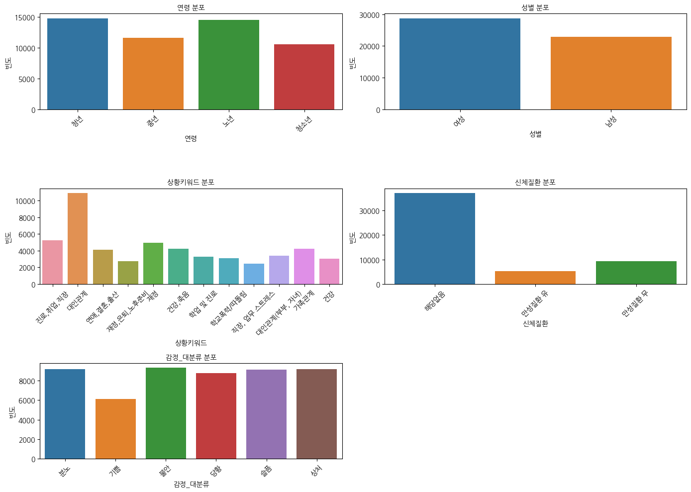
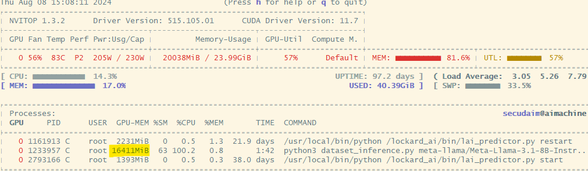

# LLM_PEFT_with_Sentiment_Dataset

### Abstract
감성 대화 말뭉치를 LLM fine tuning을 진행시키고 학습전과 후의 성능 비교를 통해 특정 도메인의 언어를 학습시켰을때 더 정확도가 높아지는 지를 확인한다.

### Description
- Dataset : [감성 대화 말뭉치](https://www.aihub.or.kr/aihubdata/data/view.do?currMenu=115&topMenu=100&aihubDataSe=realm&dataSetSn=86)
- LLM model : Llama3.1-8B-Instruct

# 감정 매칭 프로젝트

LLM 모델이 감정 코퍼스 데이터셋을 사용한 파라미터 효율적 미세 조정(Parameter Efficient Fine Tuning, PEFT)을 수행하기 전후로 입력 문장의 감정을 얼마나 잘 매칭하는지 테스트하는 것을 목표로 합니다.

## 개요

이 프로젝트의 주요 목표는 다음과 같습니다:
1. 입력 문장의 감정을 매칭하는 초기LLM의 성능을 평가합니다.
2. 감정 코퍼스 데이터셋을 사용하여 모델을 PEFT(QLoRA로 진행)합니다.
3. 미세 조정된 모델의 성능을 재평가하고 초기 결과와 비교합니다.

## 데이터셋

이 프로젝트에서는 AI Hub에서 가져온 감정 코퍼스 데이터셋을 사용합니다. 이 데이터셋은 다양한 문장과 해당 감정 레이블을 포함하고 있습니다 .

## 방법론

1. **초기 평가**: 감정 코퍼스 데이터셋에서 LLM의 성능을 평가합니다.
2. **파라미터 효율적 미세 조정 (PEFT)**: 감정 코퍼스 데이터셋을 사용하여 LLM을 fine tuning합니다.
3. **조정 후 평가**: 동일한 데이터셋에서 fine tuning된 모델의 성능을 재평가합니다.
4. **비교 및 분석**: fine tuning 전후의 결과를 비교하여 PEFT의 효과를 확인합니다.

## 요구 사항

- Python 3.8 이상
- PyTorch
- Hugging Face Transformers
- 기타 필요한 종속성은 `requirements.txt`에 나와 있습니다.

## 설치

저장소를 클론하고 필요한 종속성을 설치합니다:

```bash
git clone https://github.com/yourusername/emotion-matching-project.git
cd emotion-matching-project
pip install -r requirements.txt
```

# 진행
## EDA


## QLoRA config code
```python
from peft import LoraConfig, PeftModel, PeftConfig

lora_config = LoraConfig(
    r=6,
    lora_alpha = 8,
    lora_dropout = 0.05,
    target_modules=["q_proj", "o_proj", "k_proj", "v_proj", "gate_proj", "up_proj", "down_proj"],
    task_type="CAUSAL_LM",
)

bnb_config = BitsAndBytesConfig(
    load_in_4bit=True,
    bnb_4bit_quant_type="nf4",
    bnb_4bit_compute_dtype=torch.float16
)

start = time.time()
BASE_MODEL = "meta-llama/Meta-Llama-3.1-8B-Instruct"
model = AutoModelForCausalLM.from_pretrained(BASE_MODEL, device_map="auto", quantization_config=bnb_config) # 양자화 함
# model = AutoModelForCausalLM.from_pretrained(BASE_MODEL, device_map="auto") # 양자화 하지 않음
tokenizer = AutoTokenizer.from_pretrained(BASE_MODEL, add_special_tokens=True)
end = time.time()
print("download elapsed time: {}".format(end - start))
```
- 위와 같이 BitsAndBytesConfig 모듈로 PLM모델의 가중치에 대해 양자화를 하여 GPU 메모리에 모델을 로드한다.

```python
os.environ["TOKENIZERS_PARALLELISM"] = "false"

trainer = SFTTrainer(
    model=model,
    train_dataset=dataset,
    max_seq_length=512,
    args=TrainingArguments(
        output_dir="outputs",
#        num_train_epochs = 1,
        max_steps=3000,
        per_device_train_batch_size=1,
        gradient_accumulation_steps=1,
        optim="paged_adamw_8bit",
#         warmup_steps=0.03,
        learning_rate=2e-4,
        fp16=True,
        logging_steps=100,
        push_to_hub=False,
        report_to='none',
    ),
    peft_config=lora_config,
    formatting_func=formatting_prompts_func
)
```
- SFFTrainer(Supervised Fine Tuning Trainer)를 이용하여 LoRA fine tuning 진행

### Inference 

- meta-llama/Meta-Llama-3.1-8B-Instruct Base모델 GPU 메모리에 load
- 약 16GB 크기


- QLoRA fine tuning 진행한 모델 GPU 메모리에 load
- 약 7GB크기
